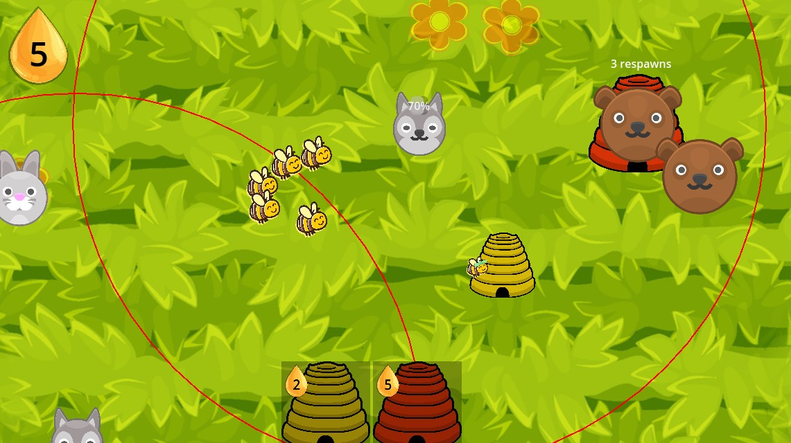

# Honey Horizon
Honey Horizon was made for the [GMTK 2024 game jam](https://itch.io/jam/gmtk-2024) by a team of three people, around the theme “Built to Scale.”



## Keybinds
- **WASD/ZQSD**: Camera movement
- **E**: Lock/Unlock the attacker bees somewhere on the map
- **M**: Toggle whether or not the camera can also be moved by dragging the mouse outside the boundaries of the screen.
- **Click** on an item in the shop at the bottom of the screen to select it, or alternatively use the numerical keys **1**, **2**, ... and so on. Then, click somewhere on the map to place the selected item. This action can be canceled by pressing **ESC**.

## Goal of the game
Try to survive as long as possible.

## Documentation
### Prerequisites
- [Godot](https://godotengine.org/download/)
  > Since this project doesn't use C#, the standard Godot Engine download should suffice. However, the Godot Engine - .NET build should also still work.

### Cloning Honey Horizon
- Cloning using *Git*:
    ```
    git clone https://github.com/jam53/GMTK-Gamejam-2024.git
    ```
- Cloning using *GitHub Desktop*:
    - Open GitHub Desktop > file > Clone repository > URL > enter the following url: https://github.com/jam53/GMTK-Gamejam-2024.git and press *Clone*.

### Building Honey Horizon
To export a standalone binary for Honey Horizon:

1. Navigate to `Project > Export...`.
2. Select the **Windows Desktop** export preset.
3. Click on **Export Project...**.
4. Choose the path where you want to save the exported project.
5. Untick the `Export With Debug` option.

> While exporting the project, you may run into the following warning, which you can ignore:
> ```
> Resources Modification: Could not start rcedit executable. 
> Configure rcedit path in the Editor Settings (Export > Windows > rcedit),
> or disable 'Application > Modify Resources' in the export preset.
> ```

### Sources
* [Bee (attacker)](https://www.vecteezy.com/png/1203858-bee)
* [Grass](https://www.vecteezy.com/vector-art/8289688-seamless-texture-cartoon-grass-green-plants-pattern-for-wallpaper-vector-illustration-backdrop-organic-background-for-the-game-gui)
* [Honey drop](https://www.vecteezy.com/vector-art/14347164-honey-drop-icon-cartoon-vector-bee-nectar)
* [Flowers](https://delirioussteve.itch.io/flower-power-2d-imagesicons)
* [Hive](https://clipart-library.com/clipart/6Tp6Knqyc.htm)
* [Music: RF Country Landscape by legacyAlli](https://freemusicarchive.org/music/legacyAlli/legacyAlli-RF_Country_Landscape)
* [Death sound: Death Sound Pixel by gamer500](https://freesound.org/s/692084/)

